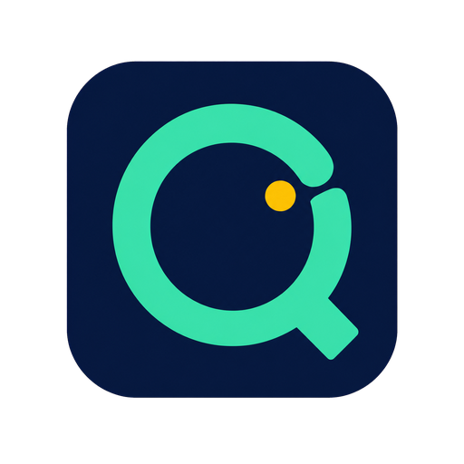

<p align="center">
  
</p>

# QuotaPeek for Codex

[简体中文](README.zh-CN.md)

QuotaPeek adds a compact, read-only quota panel to the bottom of the Windows
Codex/ChatGPT sidebar. It shows the general allowance without covering
conversations or the account menu, and it has no tray icon or separate window.

This is an unofficial community project and is not made or supported by OpenAI.

## Install

Requirements: Windows 11 x64, the Microsoft Store Codex/ChatGPT app
(`OpenAI.Codex`), Node.js 22 or newer, and a ChatGPT account signed in to Codex.

1. Install [Node.js 22 or newer](https://nodejs.org/) if needed.
2. Fully exit every Codex/ChatGPT desktop process.
3. Open **PowerShell** in any directory. You do not need to clone this repository
   or run `cd`.
4. Run:

   ```powershell
   npx.cmd --yes quotapeek@latest install
   ```

5. When installation succeeds, directly open **QuotaPeek for Codex** from the
   Desktop or Start menu.

The install command creates the shortcuts but does **not** launch Codex. There
is no extra `npx ... start` step. QuotaPeek is stored under
`%LOCALAPPDATA%\CodexQuota`; you do not need to open that directory.

For every future cold start, use **QuotaPeek for Codex**. If Codex is already
running, its official icon can still bring the same process to the foreground.

## What it shows

- The general Codex allowance only, without model-specific duplicates.
- A recognized plan such as Free, Plus, Pro 5×, or Pro 20×.
- Remaining percentage, limit period, reset time, and countdown.
- Green, amber, and red progress states as allowance decreases.
- The most recent cached value marked **Refreshing** until live data arrives.

The panel follows the Codex interface language automatically. English,
Simplified Chinese, and Traditional Chinese are built in; other languages fall
back to English. When usable data is available, QuotaPeek hides the equivalent
native footer quota.

## Update

Routine Codex desktop updates require no QuotaPeek reinstall. To update
QuotaPeek itself, run this from any PowerShell directory, fully exit Codex, and
then reopen **QuotaPeek for Codex**:

```powershell
npx.cmd --yes quotapeek@latest install
```

An update safely replaces shortcuts created by this project, including the old
**Codex + Quota** name. Same-name shortcuts not owned by QuotaPeek are preserved.

## Troubleshooting

If the panel does not appear:

1. Fully exit Codex/ChatGPT; check Task Manager if needed.
2. Cold-start it through **QuotaPeek for Codex**, not the official shortcut.
3. Run from any PowerShell directory:

   ```powershell
   npx.cmd --yes quotapeek@latest doctor --live
   ```

If the hidden launch does nothing, inspect
`%LOCALAPPDATA%\CodexQuota\logs\launcher-error.log`. Never publish `auth.json`,
the contents of `%LOCALAPPDATA%\CodexQuota`, or unreviewed raw logs.

As a terminal-only alternative to the shortcut, run:

```powershell
npx.cmd --yes quotapeek@latest start
```

## Uninstall

Run from any PowerShell directory, then fully exit Codex and reopen it through
the official shortcut:

```powershell
npx.cmd --yes quotapeek@latest uninstall
```

## Security and development

QuotaPeek does not modify the Store package, `app.asar`, Codex configuration,
or account credentials. It uses a random loopback CDP port and the official
local app-server. See [SECURITY.md](SECURITY.md) for the security boundary.

```powershell
npm.cmd run check
npm.cmd test
npm.cmd pack --dry-run
```

See [CONTRIBUTING.md](CONTRIBUTING.md),
[docs/RELEASING.md](docs/RELEASING.md), and the [MIT license](LICENSE).
